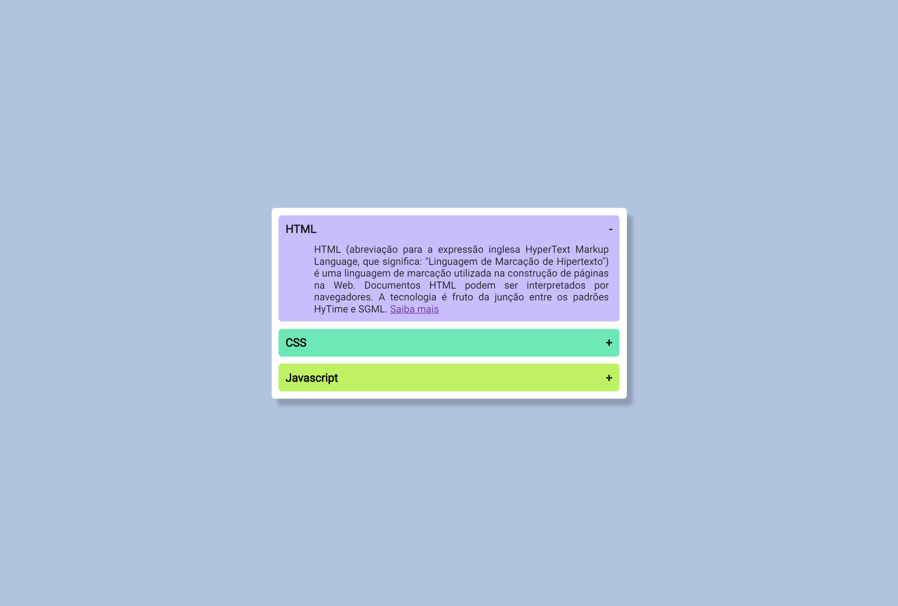

# Accordion com Javascript
 

 

Desenvolvido para aprendizado. Realizado accordion com Javascript. 22/10/22

[🔗 Clique aqui para acessar] (https://michel-maia.github.io/Accordion-com-Javascript/)

## 💻 Tecnologias

- HTML
- CSS
- Javascript

## Referência

- [Youtube] https://www.youtube.com/c/WillDev2022

